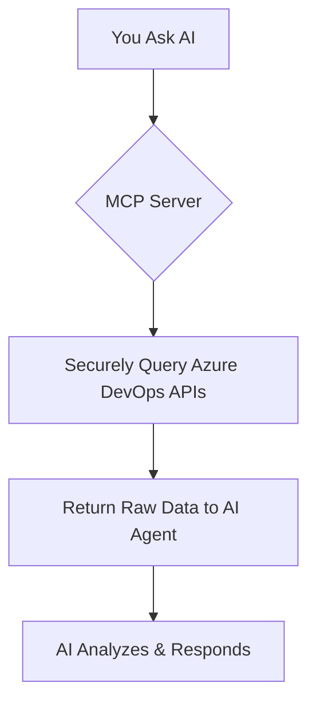

```markdown
# Integration Bytes - Understanding Azure DevOps MCP Server

**Today's Integration Bytes Content is Contributed by Gopalakrishnan Palanisamy**

## What is Azure DevOps MCP Server?

Azure DevOps Model Context Protocol (MCP) Server is a **secure, local AI agent bridge** that enables your AI coding assistant (like GitHub Copilot, Claude, Cursor, etc.) to **interact directly with your Azure DevOps data** — work items, pull requests, pipelines, test plans, and more — **without sending sensitive data outside your network**.

It runs **locally in your environment**, acts as a **trusted proxy**, and empowers AI agents to perform **context-aware operations** using natural language, all while maintaining **enterprise-grade security and compliance**.

There are two types of MCP Server deployments:

1. **Azure DevOps MCP Server** – Focused on **Azure DevOps Services** (cloud)
2. **Azure DevOps Server MCP** – For **on-premises Azure DevOps Server** (self-hosted)

---

## Benefits of Azure DevOps MCP Server

| Benefit | Description |
|-------|-----------|
| **Zero Data Exfiltration** | Runs locally — no project data leaves your network or device |
| **AI in Agent Mode** | Enables AI to **execute tools**, not just chat — fetch real data, trigger actions |
| **Natural Language DevOps** | Ask: _“What’s blocking my sprint?”_ → Get real-time blockers with recommendations |
| **No Context Switching** | Stay in VS Code/Cursor — AI pulls Azure DevOps context automatically |
| **Secure & Auditable** | Uses Azure AD authentication; full control over permissions via PAT scopes |
| **Free to Use** | No additional cost (standard Azure DevOps usage applies) |

---

## How It Works: 2-Step Intelligent Workflow



### 1. **Data Retrieval (MCP Server)**
- Securely authenticates using **Personal Access Token (PAT)** or **Azure AD**
- Executes **WIQL queries**, **REST API calls** to fetch:
  - Work items (bugs, tasks, user stories)
  - Pull requests & code reviews
  - Pipelines, builds, releases
  - Test plans & results
  - Repositories & commits

### 2. **AI Analysis (Your Assistant)**
- Processes raw data
- Generates summaries, insights, recommendations
- Suggests actions or automation

---

## Example Use Case: Sprint Health Check

**Prompt:**  
_"Get my current sprint items in project 'ContosoWeb', identify risks, and suggest mitigation."_

### MCP Server Action:
```wiql
SELECT [System.Id], [System.Title], [System.State], [Microsoft.VSTS.Scheduling.StoryPoints]
FROM WorkItems 
WHERE [System.TeamProject] = 'ContosoWeb' 
  AND [System.IterationPath] UNDER 'ContosoWeb\Sprint 42'
  AND [System.WorkItemType] IN ('Bug', 'User Story', 'Task')
ORDER BY [System.ChangedDate] DESC
```

### Raw Data Returned:
| ID | Title | State | Points | Blocked |
|----|-------|-------|--------|--------|
| 5123 | Login fails on iOS 18 | Active | 5 | Yes |
| 5101 | Implement OAuth 2.1 | In Progress | 8 | No |
| 5098 | API rate limiting | New | 3 | No |

### AI Assistant Output:

```markdown
## 🚀 Sprint 42 Health Report (ContosoWeb)

| Status | Count | Details |
|-------|-------|--------|
| ✅ On Track | 12 | Healthy velocity, good distribution |
| 🔄 In Progress | 5 | Avg. 2.4 days in progress |
| ⚠️ At Risk | **2** | **High impact** |

### 🚨 Risks Identified
| Item | Risk | Mitigation |
|------|------|-----------|
| **Bug #5123** | Blocked 4 days – iOS 18 regression | Escalate to mobile lead; pair with QA |
| **Story #5101** | 8 SP, 60% complete, due in 3 days | Add 1 more dev; break into smaller tasks |

### 📌 Recommendation
> Replan sprint: Move low-priority PBI #5089 (3 SP) to backlog.  
> Assign Dev B to unblock #5123 today.

**Velocity Projection:** 28/32 SP (87%) → Adjust scope now.
```

---

## Prerequisites

| Requirement | Details |
|-----------|--------|
| **Node.js** | v18.0 or higher |
| **Azure DevOps Org** | Active project with access |
| **AI Environment** | VS Code + GitHub Copilot, Cursor, Claude Code, etc. |
| **Authentication** | PAT with **Read** scopes (Work Items, PRs, Builds) |

> Download: [Node.js](https://nodejs.org) | [Create PAT](https://dev.azure.com/your-org/_usersSettings/tokens)

---

## Install Azure DevOps MCP Server

### Option 1: VS Code (Recommended)

1. Install **GitHub Copilot** + **Copilot Chat**
2. Install **Azure DevOps MCP Server** extension (Preview)
3. Switch Copilot to **Agent Mode**
4. Refresh tools → See **Azure DevOps MCP** appear
5. Try: _“List my active pull requests”_

### Option 2: CLI (Manual)

```bash
npx -y @azure/devops-mcp@latest server start
```

Add to `.vscode/mcp.json`:
```json
{
  "servers": {
    "Azure DevOps MCP": {
      "command": "npx",
      "args": ["-y", "@azure/devops-mcp@latest", "server", "start"]
    }
  }
}
```

Set environment:
```bash
export AZURE_DEVOPS_ORG_URL=https://dev.azure.com/your-org
export AZURE_DEVOPS_PAT=your-personal-access-token
```

---

## Security & Privacy

| Feature | Guarantee |
|--------|-----------|
| **Local Execution** | Server runs on your machine |
| **No External Calls** | Beyond Azure DevOps APIs (authenticated) |
| **PAT Never Stored** | In memory only |
| **Fine-Grained Scopes** | Limit to Read-only if needed |
| **Audit Logs** | Track all MCP queries |

> **Pro Tip:** Use a dedicated **MCP-only PAT** with minimal scopes.

---

## Common Use Cases

| Scenario | Prompt Example |
|--------|----------------|
| **Standup Prep** | “Summarize my work yesterday and blockers” |
| **PR Review** | “Get PR #123 and linked work items with business impact” |
| **Pipeline Debug** | “Why did build #4567 fail? Show logs and failed tests” |
| **Release Readiness** | “Is Sprint 42 ready to ship? List open bugs and test coverage” |
| **Backlog Grooming** | “Prioritize backlog for 2-week sprint with 3 devs” |

---

## Learning Resources

- Official Docs: [Azure DevOps MCP Server Overview](https://learn.microsoft.com/en-us/azure/devops/mcp-server/mcp-server-overview?view=azure-devops)
- GitHub Repo: [github.com/Azure/azure-mcp](https://github.com/Azure/azure-mcp) *(Archived – Active dev now at microsoft/mcp)*
- Install Guide: [Install Azure DevOps MCP Server](https://learn.microsoft.com/en-us/azure/devops/mcp-server/install-mcp-server)
- Examples: [MCP Server Usage Scenarios](https://learn.microsoft.com/en-us/azure/devops/mcp-server/example-usage)

---

## Conclusion

The **Azure DevOps MCP Server** is a **game-changer for AI-assisted development**. It transforms generic AI responses into **hyper-contextual, actionable insights** by securely connecting your AI agent to real Azure DevOps data.

By keeping everything **local, secure, and controllable**, it enables a future where developers **talk to their tools** — and the tools **understand the project**.

> **Start today:** Install the MCP Server, enable Agent Mode, and ask:  
> _“Show me what’s at risk in my current sprint.”_

---

**Integration Bytes** – *Because AI should know your code, your team, and your deadlines.*
```

---

**Ready to deploy?**  
Save this as `integration-bytes-azure-devops-mcp.md` and share with your team!  
Let me know if you want a **PDF version**, **PowerPoint slide deck**, or **email newsletter format**.
